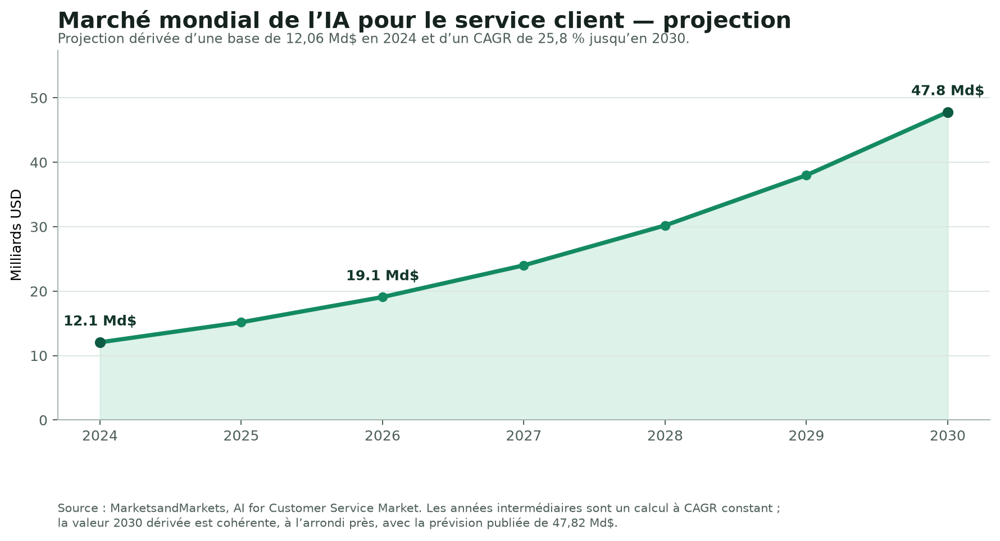

# Rapport stratégique — Algogen / AlgoLens

**Auteur : Manus AI**  
**Date : 12 août 2026**  
**Périmètre : audit produit et technique du dépôt, benchmark concurrentiel, analyse du marché de l’IA de service client, personas SaaS B2B et feuille de route.**

> **Décision stratégique principale.** Algogen ne doit pas chercher à devenir un outil généraliste de gestion de projet ni une plateforme de service client par IA. Ces deux marchés servent de **benchmarks de produit, de packaging et de GTM**. La voie crédible consiste à devenir une plateforme B2B d’**intelligence de performance organique sociale**, centrée initialement sur les équipes social media de PME, puis sur les agences. Le produit doit passer d’un générateur de conseils à une boucle mesurable : **données connectées → hypothèse sourcée → exécution → mesure → apprentissage**.

## Résumé exécutif

Le dépôt démontre une base solide de prototype SaaS : interface soignée, authentification, abonnement, cache hybride, génération structurée par IA et premières surfaces de veille. La proposition actuelle d’**AlgoLens** est cependant largement fondée sur un jeu de données éditorial statique injecté dans un LLM. Il ne s’agit donc pas encore de « rétro-ingénierie algorithmique en temps réel » au sens d’une intelligence entraînée par des données sociales propres, actualisées et attribuables. Cette distinction est centrale pour la confiance, la conformité marketing et la disposition à payer des acheteurs B2B.[1]

La priorité n’est pas d’ajouter des fonctionnalités. Il faut d’abord **fermer les écarts de fiabilité** entre ce qui est présenté et ce qui est versionné dans le dépôt : schéma de facturation incomplet par rapport au code, tableaux de bord et veille alimentés par données de démonstration en l’absence de données réelles, mode comparaison qui ne transmet pas le signal d’autorisation prévu, et parcours anonyme non plafonné. Ces écarts ne rendent pas le projet sans valeur ; ils indiquent clairement qu’il faut traiter Algogen comme un MVP à fiabiliser, pas comme un SaaS B2B déjà prêt à scaler.[2] [3] [4]

Le benchmark des logiciels de gestion de projet montre que les leaders gagnent par une promesse de travail mesurable, un modèle freemium/essai cohérent, des intégrations et une trajectoire vers la gouvernance. Les acheteurs évaluent particulièrement l’IA, mais s’attendent également à l’implémentation, aux intégrations et à l’onboarding. Dans l’enquête Capterra, **55 %** des acheteurs recherchent des fonctionnalités IA ; le budget le plus courant se situe entre **20 et 40 $ par utilisateur et par mois**.[5] Algogen doit reprendre cette leçon sans copier leur surface produit : l’IA doit rendre les décisions de contenu plus fiables et plus rapides, non seulement écrire davantage de texte.

L’analyse de l’IA de service client confirme la force d’un modèle « outcomes » : le marché mondial est estimé à **12,06 Md$ en 2024** et projeté à **47,82 Md$ en 2030**, soit **25,8 %** de croissance annuelle composée.[6] Les plateformes leaders facturent de plus en plus sur la résolution automatisée et sur l’usage, à côté des sièges.[7] [8] Pour Algogen, la transposition pertinente est de monétiser une **valeur mesurable** (marques, comptes connectés, diagnostics, espaces d’équipe, rapports, benchmarks et alertes), plutôt que de promettre une analyse « illimitée » à 9 € alors que le coût marginal IA et le risque d’abus subsistent.

| Décision | Recommandation | Justification | Horizon |
|---|---|---|---|
| **Segment initial** | Équipes social media de PME et petites agences (2–10 utilisateurs). | Douleur récurrente, besoin de reporting et de crédibilité ; valeur collaborative absente du produit actuel. | 0–90 jours |
| **Promesse** | « Transformez vos performances sociales en prochains tests de contenu priorisés, sourcés et mesurables. » | Plus défendable que « décoder l’algorithme » ; ne surestime pas ce que les plateformes exposent. | Immédiat |
| **Noyau produit** | Connexion de comptes, diagnostic par compte, recommandations sourcées, backlog d’expériences, mesure post-publication. | Crée la boucle de preuve qui manque à un dataset statique + LLM. | 31–180 jours |
| **Business model** | Gratuit de découverte, Solo, Team et Agency ; unités de valeur par comptes/marques/sièges, non par appels IA illimités. | Reflète le modèle de travail B2B et préserve la marge. | 31–90 jours |
| **GTM** | PLG pour l’audit individuel ; « product-led sales » pour comptes équipe/agence à forte intention. | Les achats B2B combinent recherche autonome, démo, validation sociale et accompagnement.[9] [10] | 31–180 jours |

## 1. Méthode et limites

L’audit s’appuie sur le dépôt privé `eulogep/Algogen`, le README, le code de la route d’analyse, les migrations et les parcours clés. Les benchmarks combinent les pages de prix des éditeurs, Capterra, G2 et Ramp. Les données de Ramp sont un **proxy d’adoption dans son échantillon de dépenses B2B américain**, et non une part de marché mondiale en chiffre d’affaires ; elles ne doivent donc pas être surinterprétées.[11]

Le marché de l’IA de service client est analysé séparément du marché réel d’Algogen, qui se situe dans la social media intelligence / martech. Il est inclus à la demande comme étude de marché et comme source de leçons de monétisation, de fiabilité des agents et de GTM. Les valeurs de **SAM** et de **SOM** sont des scénarios de planification explicitement hypothétiques ; seules les valeurs de **TAM** et de croissance publiées sont des données de marché.

## 2. Diagnostic d’Algogen : ce qui existe et ce qui doit être corrigé

### 2.1 Proposition de valeur et architecture actuelles

AlgoLens couvre sept contextes de plateforme, transforme un profil créateur en stratégie de 30 jours, propose un cache L1/L2, une veille algorithmique, un historique, une authentification Supabase et une monétisation Stripe. La stack est moderne et cohérente pour un MVP : Next.js, Supabase, Stripe, Vercel et Anthropic.[1]

Le moteur lit un contexte de plateforme depuis le jeu de données local, le place dans le prompt système et demande une réponse JSON structurée. Le dataset déclaré est en version `1.0.0` et porte une date de dernière mise à jour au **25 mars 2025**. Il contient des sources utiles, notamment officielles, mais est injecté comme contenu statique. Le produit ne relie pas encore une recommandation aux performances, à l’audience, aux publications ou aux concurrents propres du client.[2] [12]

| Dimension | Force observée | Limite ou risque | Décision recommandée |
|---|---|---|---|
| **Expérience d’entrée** | Landing claire, essai sans carte, résultat structuré et visuel. | Promesse d’« algorithme » trop affirmée au regard de données essentiellement éditoriales. | Remplacer la formulation par « intelligence de performance et recommandations sourcées ». |
| **Moteur IA** | Schéma de réponse imposé, retry et fallback. | Le score d’adéquation n’est pas calibré sur un résultat observable ; cache de réponses qui peuvent être similaires entre profils. | Afficher facteurs, sources, fraîcheur et niveau de confiance ; distinguer contenu généré et constat observé. |
| **Knowledge** | Couverture initiale de sept contextes et liens de sources. | Mise à jour manuelle/statique, absence de provenance au niveau de chaque recommandation. | Pipeline de connaissance versionné, sourcé, daté, validé et journalisé. |
| **Monétisation** | Gating serveur envisagé et webhook Stripe prévu. | Contradictions entre code de plan et migration ; analyse anonyme ouverte ; offre Pro « illimitée » fragile. | Réconcilier le schéma, tester le cycle de vie Stripe et instaurer des limites de valeur. |
| **Analytics / veille** | Surfaces produit de dashboard et de feed déjà présentes. | Fallbacks de démo et chiffres codés en dur, donc risque de décision fondée sur données non réelles. | Badges « démo », absence d’affichage plutôt que simulation, observabilité réelle. |
| **Mode comparaison** | Parcours UX utile et différenciant à court terme. | Le frontend lance deux analyses standards sans envoyer `compareMode`, rendant inopérant le contrôle Pro annoncé. | Corriger le contrat API et tester 403/upgrade de bout en bout. |

### 2.2 Écarts de production prioritaires

Le code de gestion des plans lit notamment `expires_at`, `stripe_customer_id`, `stripe_subscription_id` et `student_used` dans `profiles`. Or la migration versionnée de `profiles` ne crée que l’identifiant, l’e-mail, le plan et les compteurs de base. Les RPC de facturation invoquées par le code ne sont pas définies dans les migrations visibles. La priorité est donc de faire du dépôt une représentation reproductible de l’environnement, avant de promettre un abonnement B2B.[3]

La route d’analyse indique également que les utilisateurs non connectés peuvent analyser librement. En parallèle, le dashboard peut afficher un historique généré localement et la page de veille des entrées de démonstration. Ce sont de bons outils de démonstration, mais ils doivent être explicitement séparés de la production : autrement, le produit peut donner une impression de performance ou de veille qui ne reflète pas les données réelles.[2] [4]

> **Principe de confiance recommandé :** toute recommandation doit afficher « source des données », « date de fraîcheur », « signal observé », « hypothèse » et « action à tester ». Le produit ne doit jamais présenter une corrélation comme une connaissance certaine du classement d’une plateforme.

## 3. Projets similaires : espace concurrentiel d’Algogen

Les concurrents directs et adjacents ne sont pas seulement des générateurs de contenu. Les suites de social media management ont déjà résolu la publication, l’inbox et les rapports. Leur profondeur provient des comptes connectés, de l’historique et des workflows d’équipe. Algogen doit donc éviter la concurrence frontale sur la planification et se spécialiser sur la **priorisation d’expériences de contenu** et la **lecture explicable de la performance**.

| Produit | Segment et proposition | Tarif public indicatif | Force principale | Lacune exploitable par Algogen |
|---|---|---:|---|---|
| **Buffer** | Créateurs, PME et agences ; publication, analytics, inbox et IA. | Gratuit ; 5 $/canal/mois Essentials, 10 $/canal/mois Team (annuel). | PLG très simple, prix bas, collaboration. | Peu de conseil stratégique profond ou de boucle d’expérimentation.[13] |
| **Hootsuite** | Équipes social et entreprises ; publication, monitoring, reporting, IA. | 99 / 199 / 399 $ par utilisateur/mois. | Suite omnicanale, tendances, gouvernance. | Complexité et prix créent une ouverture pour une intelligence ciblée PME/agence.[14] |
| **Sprout Social** | Équipes matures et entreprises ; social care, intelligence concurrentielle, sentiment. | 199 / 299 / 399 $ par utilisateur/mois. | Données connectées, workflow et reporting solides. | Prix/complexité élevés pour les PME ; Algogen peut offrir un diagnostic plus immédiat.[15] |
| **Socialinsider** | Analytics et benchmark concurrentiel. | À partir de 83 $/mois. | Comparaison de comptes, reporting, export. | Peu de traduction directe en tests de contenu recommandés.[16] |
| **Metricool / Later / SocialPilot** | PME, créateurs et agences ; publication et reporting. | Gammes freemium à milieu de marché. | Distribution PLG et pragmatisme opérationnel. | L’opportunité est de fournir l’« intelligence next best action », pas un énième calendrier. |
| **FeedHive / Predis.ai** | IA de création et de recyclage de contenu. | Généralement self-service. | Rapidité de production et adaptation de copy. | Risque de contenu générique ; Algogen doit se différencier par la preuve de performance. |

La discontinuité stratégique est donc la suivante : **les suites savent publier et mesurer ; Algogen doit savoir expliquer quoi tester ensuite, pourquoi, pour quel objectif et comment vérifier que cela marche.** Cette capacité devient défendable seulement si les conclusions sont reliées aux données client et à une base de connaissance maintenue.

## 4. Analyse comparative — 10 acteurs majeurs du logiciel de gestion de projet

### 4.1 Lecture de marché

Capterra classe Asana, Jira et Notion à **95/100**, Trello à **93**, ClickUp et monday.com à **91**, Smartsheet à **90**, Wrike à **87**, Basecamp à **86** et Odoo à **85**. Le score combine popularité et notes : c’est un indicateur de satisfaction/visibilité utile, pas une part de marché financière.[17] G2 affichait Jira à **4,3/5 sur 7 934 avis** lors de l’étude.[18]

Ramp observe dans son propre univers de dépenses B2B : Jira **49 %**, Notion **32 %**, Asana **19 %**, monday.com **15 %** et Linear **15 %** d’adoption parmi les entreprises achetant dans la catégorie. Ces chiffres sont les seuls chiffres de « part » comparables publiquement collectés ici ; les cellules non publiées sont signalées comme telles plutôt que remplacées par une estimation.[11]

| Acteur | Fonctionnalités structurantes | Prix public d’entrée observé | Proxy d’adoption / position | Satisfaction / friction de marché | Stratégie de mise sur le marché |
|---|---|---:|---|---|---|
| **Jira** | Backlog, agile, workflows configurables, automatisation, planification inter-équipes. | Gratuit jusqu’à 10 utilisateurs ; Standard/Premium via calculateur. | **49 % Ramp**, leader de l’échantillon. | Capterra 95/100 ; puissant mais courbe d’apprentissage. | Écosystème Atlassian, développeurs puis extension entreprise.[11] [19] |
| **Asana** | Tâches, portfolio, objectifs, charge, Gantt, formulaires, reporting et IA. | 0 ; **10,99 $** Starter ; **24,99 $** Advanced / utilisateur/mois annuel. | **19 % Ramp**. | Capterra 95/100 ; très bon pour le travail transversal. | PLG, templates, adoption équipes puis vente enterprise.[17] [20] |
| **Notion** | Wiki, documents, bases, projets, IA, recherche et agents. | Gratuit ; prix par siège selon Plus/Business ; crédits IA à l’usage. | **32 % Ramp**. | Capterra 95/100 ; souplesse forte, paramétrage potentiellement déroutant. | Bottom-up autour du savoir et de la collaboration, puis expansion équipe.[11] [21] |
| **Trello** | Kanban, cartes, automatisation, power-ups, vues et IA. | Gratuit ; environ **5 $** Standard ; **12,50 $** Premium / utilisateur/mois annuel. | Non publié par Ramp dans le top 5. | Capterra 93/100 ; simplicité supérieure, profondeur PPM limitée. | PLG très accessible et réseau Atlassian.[17] [22] |
| **ClickUp** | Tâches, documents, vues, objectifs, automatisations et IA convergée. | Gratuit ; **7 $** Unlimited ; **12 $** Business / utilisateur/mois sur G2. | Non publié dans le top 5 Ramp. | Capterra 91/100 ; richesse fonctionnelle mais complexité possible. | « Tout-en-un » self-service, consolidation du stack, contenu comparatif.[17] [23] |
| **monday.com** | Boards configurables, automatisations, intégrations, portfolio, ressource et IA. | Gratuit ; **9 $** Basic ; **12 $** Standard / siège/mois annuel. | **15 % Ramp**. | Capterra 91/100 ; très accessible et visuel. | Templates par cas d’usage, PLG puis commercialisation multi-produit/enterprise.[11] [24] |
| **Smartsheet** | Tableur structuré, workflows, formulaires, projet/programme/portfolio. | Essai 30 jours ; Pro/Business/Enterprise selon configuration. | Non publié dans le top 5 Ramp. | Capterra 90/100 ; apprécié pour opérations structurées. | Entrée opérationnelle, extensions PPM et vente enterprise.[17] [25] |
| **Wrike** | Work delivery, planning, approbations, reporting, sécurité, IA. | Essai 14 jours ; tiers Team/Business/Enterprise, devis selon volume. | Non publié dans le top 5 Ramp. | Capterra 87/100 ; solide pour déploiements guidés. | Vente assistée, services professionnels et déploiement entreprise.[17] [26] |
| **Basecamp** | Coordination de projet, messages, fichiers, calendrier et simplicité. | Politique tarifaire simplifiée ; prix non exposé dans l’extrait consulté. | Non publié. | Capterra 86/100 ; appréciation de la simplicité, moins de PPM avancé. | Marque forte, self-service et positionnement anti-complexité.[17] [27] |
| **Odoo** | Suite ERP modulaire incluant Projet, CRM, finance et automatisation. | Une application gratuite ; Standard/Custom pour toutes les apps, prix configuré au besoin. | Non publié. | Capterra 85/100 ; largeur de suite, effort d’implémentation plus élevé. | Land-and-expand via apps et réseau de partenaires.[17] [28] |

### 4.2 Leçons transférables à Algogen

Le benchmarking établit cinq principes utiles. Premièrement, les leaders vendent des **résultats de travail** : visibilité, planification, coordination, reporting et gouvernance. Deuxièmement, la gratuité est une étape d’activation, pas un coût indéfini. Troisièmement, l’IA est intégrée au workflow (résumés, automatisation, risques), et non présentée comme une fonctionnalité isolée. Quatrièmement, les intégrations et la confiance opérationnelle deviennent décisives au moment où l’usage s’étend. Enfin, la plupart des leaders passent d’un utilisateur individuel à une équipe grâce aux contenus partagés, aux permissions, aux rapports et aux processus.

Pour Algogen, la transposition est directe : ne pas construire un gestionnaire de tâches généraliste, mais intégrer une petite couche de workflow là où elle crée une preuve de valeur — backlog de tests, responsable, échéance, statut de publication, résultat et apprentissage.

## 5. Taille du marché — IA pour le service client

### 5.1 TAM et croissance

MarketsandMarkets estime le marché mondial de l’IA pour le service client à **12,06 Md$ en 2024**, avec une projection à **47,82 Md$ en 2030** (CAGR **25,8 %**). La source associe la croissance aux agents IA, à l’automatisation, à l’analytique temps réel, au libre-service omnicanal et à la personnalisation.[6]

La valeur **2026 de 19,1 Md$** dans le graphique est un calcul à CAGR constant depuis 2024 ; elle n’est pas une estimation indépendante publiée. Elle est utilisée pour construire un modèle transparent.

| Niveau | Définition et formule | Valeur | Statut |
|---|---|---:|---|
| **TAM 2026** | Marché mondial de l’IA de service client : `12,06 × (1,258)^2`. | **19,09 Md$** | Estimation dérivée de la donnée publiée.[6] |
| **SAM 2026** | Sous-marché adressable initialement : logiciels cloud B2B de service client, ciblant le mid-market en Amérique du Nord/Europe et vendus en SaaS. Hypothèse de cadrage : **15 % du TAM**. | **2,86 Md$** | Hypothèse de planification ; à affiner avec données de géographie, verticales et budgets. |
| **SOM à 3 ans** | Objectif prudent de **0,1 % du SAM** à maturité initiale. | **2,86 M$ ARR** | Scénario, pas une prédiction. |
| **Test de cohérence SOM** | 250 comptes à 1 000 $ de MRR moyen produisent `250 × 1 000 × 12`. | **3,00 M$ ARR** | Objectif opérationnel cohérent avec le SOM scénarisé. |

### 5.2 Moteurs, freins et implications

Les moteurs structurels sont la nécessité de répondre en continu, l’augmentation des volumes de tickets, la recherche de baisse du temps de traitement, la disponibilité du langage génératif, la capacité à agir sur plusieurs canaux et la personnalisation. Zendesk rapporte que 73 % des agents pensent qu’un copilote IA les aiderait à mieux travailler ; Intercom rapporte que 82 % des dirigeants ont investi dans l’IA de service client sur les douze derniers mois, mais que seuls 10 % atteignent une maturité de déploiement.[29] [30]

Les freins sont au moins aussi importants : qualité des réponses, maîtrise des données, conformité, sécurité, capacité à gérer l’émotion ou les cas complexes, difficulté d’intégration au système de référence et mesure des résolutions réellement automatisées. Les scénarios de marché doivent donc considérer les services d’implémentation, de knowledge management et d’assurance qualité comme des coûts, pas comme des détails secondaires.[6]

| Moteur ou frein | Impact marché | Implication produit / GTM |
|---|---|---|
| **Omnicanal et 24/7** | Augmente l’intérêt pour l’automatisation et le routage. | Vendre des workflows reliés aux systèmes, non un chatbot isolé. |
| **Passage du coût à l’outcome** | Favorise les métriques de résolution et la facturation à la valeur. | Instrumenter une définition auditable de la résolution. |
| **Maturité d’adoption faible** | Opportunité forte, mais risque de POC sans mise à l’échelle. | Onboarding, données, QA et success doivent être inclus dès le pilote. |
| **Qualité, empathie et confiance** | Un mauvais échange peut dégrader fidélité et marque. | Escalade humaine, transparence IA, politiques de sécurité et mesure CSAT. |
| **Écosystèmes CRM / contact center** | Les plateformes historiques possèdent données et canaux. | Les entrants doivent être multi-stack ou s’ancrer sur une verticale. |

### 5.3 Cartographie concurrentielle de l’IA de service client

| Couche concurrentielle | Acteurs représentatifs | Positionnement et avantage | Modèle économique / GTM observé |
|---|---|---|---|
| **Suite CX / helpdesk IA** | Zendesk, Intercom, Freshworks, Gorgias. | Données de tickets, inbox et knowledge déjà en place ; déploiement plus simple pour leur base. | Sièges + usage/résolution. Zendesk part de 19 $/agent/mois ; Intercom facture Fin à 0,99 $ par issue.[7] [8] |
| **CRM et contact center enterprise** | Salesforce, Microsoft, ServiceNow, Genesys, NICE. | Données client, sécurité, intégrations et partenaires. | Contrats enterprise, licences, crédits IA et services ; Salesforce Service est affiché à partir de 175 $/utilisateur/mois en Enterprise.[31] |
| **Agents IA natifs / multi-stack** | Ada, Forethought, Decagon, Sierra, Cognigy, Kore.ai, ASAPP. | Spécialisation autonomie, orchestration et intégration dans le stack existant. | Vente assistée, pilotes, ROI par résolution ; différenciation sur qualité, actions et gouvernance. |
| **Verticales e-commerce** | Gorgias, Yuma, Kustomer. | Intégrations commandes, retours et catalogue. | Prix par ticket / interaction et intégrations verticales ; Gorgias démarre à 40 $/mois puis facture les usages additionnels.[32] |
| **Knowledge et intelligence** | Coveo, Guru, capacités RAG internes. | Recherche et véracité de la connaissance pour agents humains et automatisés. | Vente plateforme/enterprise et partenariats avec CRM/CX. |

La leçon pour Algogen est de viser un **wedge vertical** et une source de vérité spécifique, plutôt que de concurrencer la plateforme généraliste. La version sociale de ce principe est : comptes connectés, contenus publiés, métriques, hypothèses de tests et rapports clients.

## 6. Personas B2B et parcours de décision

Les personas sont des hypothèses stratégiques conçues à partir du produit et des pratiques d’achat SaaS B2B. Ils doivent être validés par 12 à 15 entretiens qualitatifs, puis par données d’usage. Wynter constate notamment que les décideurs marketing B2B accordent une forte place aux pairs, au site, aux démonstrations et aux avis ; Gartner recommande d’orchestrer un parcours hybride plutôt qu’un libre-service isolé.[9] [10]

| Persona | Travail à accomplir | Douleur principale | Critères de décision | Produit et offre adaptés |
|---|---|---|---|---|
| **Léa — social media manager de PME** | Livrer un calendrier crédible et expliquer les priorités à son responsable. | Conseils génériques, données dispersées, temps de reporting. | Gain de temps, recommandations justifiées, export, prix prévisible. | Diagnostic par compte, plan de 14 jours, rapport partageable ; plan Team. |
| **Mathis — directeur d’agence / consultant** | Gérer plusieurs marques et démontrer la valeur du conseil. | Veille manuelle, benchmark hétérogène, reporting non brandé. | Multi-marques, benchmark, export, collaboration et droits. | Workspace Agency, rapports white-label, partage client, alertes. |
| **Inès — responsable contenu/growth** | Transformer la performance organique en expérimentations priorisées. | Difficile de relier stratégie, exécution et résultat. | Intégrations, ROI, sécurité, visibilité transverse. | Score d’opportunité, backlog de tests, résultats par cohorte ; vente assistée. |
| **Romain — créateur professionnel** | Gagner du temps et franchir un palier de croissance seul. | Surcharge de conseils contradictoires, peu de plan personnalisé. | Simplicité, vitesse, faible prix et idées actionnables. | Point d’entrée PLG : audit gratuit limité, 3 actions à 48 h, plan Solo. |

Le parcours B2B n’est pas linéaire : les personnes reviennent à l’exploration, aux exigences, à la validation et au consensus. Il faut donc concevoir des preuves à chaque étape.[10]

| Étape | Besoin du compte | Friction actuelle probable | Intervention Algogen | Indicateur |
|---|---|---|---|---|
| **Découverte** | Comprendre la stagnation de portée ou préparer une campagne. | « C’est un générateur IA de plus. » | SEO par problème et plateforme, exemple de diagnostic sourcé, études de cas. | Visite qualifiée → inscription. |
| **Évaluation** | Évaluer confiance, pertinence et différence. | Jeu de données statique, promesse algorithmique invérifiable. | Connexion d’un compte ou sandbox, datation des sources, niveau de confiance, comparaison avant/après. | Démarrage audit, connexion de compte. |
| **Activation** | Obtenir un premier plan utile rapidement. | Formulaire trop long, pas de donnée propre, recommandation abstraite. | Premier insight + tâche + mesure en moins de 10 minutes. | Time-to-first-value, activation. |
| **Validation / achat** | Construire le consensus et justifier le budget. | Absence de ROI, collaboration ou sécurité. | Rapport partageable, historique, calculateur de temps, démo pour PQL. | Essai → payant, PQL → démo. |
| **Adoption / rétention** | Apprendre des résultats au fil des semaines. | Les recommandations ne sont pas exécutées ni comparées. | Alertes, rappels, revue hebdomadaire, journal d’expériences. | WAU/MAU, rétention 30/90 j, taux de test complété. |

## 7. Feuille de route d’amélioration priorisée

### 7.1 0–30 jours : rendre le produit vrai, traçable et mesurable

| Priorité | Chantier | Livrable et critère d’acceptation | KPI de contrôle |
|---|---|---|---|
| **P0** | Réconcilier schéma Supabase, `lib/plans.ts`, webhooks Stripe et RPC. | Migrations complètes, tests du cycle free → pro → annulation → downgrade, environnement reproductible. | 100 % des tests de plan verts ; zéro erreur de colonne/RPC. |
| **P0** | Fermer le parcours anonyme. | Limite anti-abus par IP/appareil + compte requis après une découverte contrôlée. | Coût IA par inscription, taux d’abus, conversion visite → compte. |
| **P0** | Supprimer les ambiguïtés de démonstration. | Badges explicites « démo » ou états vides ; aucune métrique simulée mélangée à des données réelles. | Pourcentage de surfaces alimentées par données réelles. |
| **P0** | Corriger le mode comparaison. | `compareMode: true` transmis, réponses 403 gérées, modal upgrade fonctionnelle, test E2E. | Taux de comparaison, taux de paywall, erreurs API. |
| **P0** | Instrumenter l’entonnoir. | Événements : signup, plateforme choisie, audit démarré, résultat vu, sauvegardé, partagé, upgrade, churn. | Activation et conversion par canal/plateforme. |
| **P1** | Ajouter la provenance de la recommandation. | Chaque levier affiche sources, date, niveau de confiance et type : fait observé / hypothèse. | Taux de clic source ; taux de confiance déclaré. |

### 7.2 31–90 jours : créer le wedge défendable

Le premier objectif produit est de connecter au moins une source de performance autorisée et de montrer une boucle de mesure. Il faut privilégier un ou deux cas d’usage de haute fréquence plutôt qu’essayer de rendre les sept plateformes uniformément « temps réel ».

| Priorité | Chantier | Décision produit | KPI de réussite |
|---|---|---|---|
| **P1** | Diagnostic connecté | Commencer par un compte et une plateforme prioritaire ; importer métriques disponibles, objectifs, formats et historique. | Taux de connexion ; premier diagnostic terminé ; rétention 14 jours. |
| **P1** | Backlog d’expériences | Transformer chaque recommandation en test : hypothèse, format, date, responsable, KPI et résultat. | Recommandation → test créé ; test → résultat renseigné. |
| **P1** | Mesure et apprentissage | Comparer contenu testé à un baseline cohérent ; signaler corrélation, non causalité. | Part des comptes ayant une revue hebdo ; tests répliqués. |
| **P1** | Veille de connaissance | Ingestion, source, date, validation humaine et invalidation des règles obsolètes. | Couverture sourcée ; âge médian de connaissance ; erreurs signalées. |
| **P1** | Segmentation de l’onboarding | Parcours distincts créateur, PME et agence ; ne demander que les informations utiles au premier résultat. | Time-to-value ; activation par persona. |

### 7.3 91–180 jours : monétiser l’équipe et l’agence

L’extension B2B doit s’appuyer sur des objets ayant une valeur économique naturelle : **workspace, marque, compte connecté, membre, rapport partagé et benchmark**, pas uniquement sur un quota de prompts. Une proposition de packaging de départ est présentée ci-dessous ; elle doit être testée par recherche de prix et pilotes, non imposée comme vérité finale.

| Offre proposée | Cible | Entitlements | Indication de prix à tester | Rôle dans le funnel |
|---|---|---|---:|---|
| **Free Diagnostic** | Créateur ou prospect PME. | 1 compte, audit de découverte, résultat partageable limité. | 0 € | Acquisition et compréhension du besoin. |
| **Solo** | Créateur professionnel. | 1 marque, comptes limités, historique, tests et alertes de base. | **19–29 €/mois** | Conversion de l’utilisateur individuel activé. |
| **Team** | PME. | 1–3 marques, 3 sièges, rapports, calendrier de tests, export. | **79–129 €/mois** | Première offre B2B. |
| **Agency** | Agence/consultant. | Multi-marques, droits, rapports white-label, benchmark, clients invités. | **199–399 €/mois** | Expansion par portefeuille et valeur client. |

L’offre actuelle à 9 € pour de l’« illimité » risque de réduire la perception de valeur B2B tout en exposant la marge aux appels IA. Le prix doit être confirmé par un test de disposition à payer et être relié à un résultat récurrent, pas à la quantité brute de génération.

## 8. Plan GTM et expérimentation

Algogen doit opérer un double mouvement. Le produit gratuit donne un résultat individuel immédiat ; les signaux d’usage déclenchent une action humaine pour les comptes à potentiel. C’est un modèle de **product-led sales** cohérent avec les achats B2B hybrides.[10] [33]

| Sprint | Hypothèse | Expérience | Signal de décision |
|---|---|---|---|
| **S1** | Les équipes préfèrent la preuve de performance à la promesse « algorithme ». | A/B test de landing : « décode l’algorithme » vs « priorise les prochains tests à partir de ta performance ». | Inscription, démarrage audit, confiance déclarée. |
| **S2** | Un résultat connecté active plus qu’un formulaire descriptif. | Comparer onboarding manuel et connexion/import minimal. | Time-to-value et activation. |
| **S3** | Les agences paient pour le reporting et le benchmark. | Prototype de rapport client partageable avec trois agences pilotes. | Utilisation hebdo, partage, volonté de payer. |
| **S4** | Une recommandation est retenue si elle devient une tâche mesurable. | Ajouter « créer un test » sur les quick wins. | Recommandation → tâche → résultat. |
| **S5** | Le plan Team est plus crédible que l’illimité à 9 €. | Test de prix et de package sur cohorte PQL. | Conversion, revenu par compte, rétention 30 jours. |

Les canaux à privilégier sont le SEO axé problèmes (« pourquoi mes Reels plafonnent », « benchmark LinkedIn B2B »), les partenariats avec consultants/agences, les études de cas fondées sur des tests réels et les contenus LinkedIn. Les campagnes froides ne doivent pas être le moteur initial : les recherches de Wynter montrent le poids des pairs, du site, des démos et des avis tiers dans la shortlist.[9]

## 9. Indicateurs de pilotage

| Domaine | Indicateurs à instrumenter | Pourquoi ils comptent |
|---|---|---|
| **Acquisition** | Visite qualifiée → signup ; source ; coût par compte activé. | Distinguer intérêt de la vraie intention. |
| **Activation** | Compte connecté, premier audit, première recommandation sauvegardée, premier test créé, délai jusqu’au premier résultat. | Mesurer le « aha moment », non les simples visites. |
| **Valeur** | Tests complétés, changement de KPI contextualisé, rapports partagés, sources consultées. | Vérifier que les recommandations influencent le travail. |
| **Monétisation** | Free → PQL, PQL → démo, essai → payé, ARPA par persona. | Identifier la traction B2B réelle. |
| **Rétention** | WAU/MAU, rétention 30/90 jours, marques actives, usage par siège. | Séparer curiosité ponctuelle et workflow récurrent. |
| **Confiance / qualité** | Taux d’escalade, retours « inexact », fraîcheur des sources, score de confiance. | La fiabilité est le facteur de différenciation. |

## 10. Conclusion : le plan d’action du fondateur

Dans les deux prochaines semaines, la décision la plus utile est de choisir **un segment unique** — de préférence les petites agences et les social media managers de PME — et de mener une série d’entretiens. Le but est de vérifier si leur douleur est bien : « je ne sais pas quoi tester ensuite, ni comment prouver que mon plan fonctionne ».

En parallèle, la branche produit doit devenir cohérente et déployable : migrations, tarifs, quotas, comparateur et données démo doivent être assainis. Ensuite seulement, la version connectée peut être construite autour d’un compte, d’un baseline et d’un test. Cette séquence crée un avantage qui n’est pas réductible à un prompt : une base d’apprentissage propre à chaque marque et un workflow qui rend la stratégie sociale mesurable.

> **Positionnement final recommandé :** « Algogen aide les équipes social media à transformer leurs données de performance en prochains tests de contenu priorisés, sourcés et mesurables. »

---

## Références

[1]: https://github.com/eulogep/Algogen/blob/master/README.md "Algogen README — proposition de valeur, fonctionnalités et stack"
[2]: https://github.com/eulogep/Algogen/blob/master/app/api/analyze/route.ts "Algogen — route d’analyse"
[3]: https://github.com/eulogep/Algogen/blob/master/lib/plans.ts "Algogen — logique des plans"
[4]: https://github.com/eulogep/Algogen/blob/master/supabase/migrations/005_profiles.sql "Algogen — migration profiles"
[5]: https://www.capterra.com/project-management-software/ "Capterra — Project Management Software"
[6]: https://www.marketsandmarkets.com/Market-Reports/ai-for-customer-service-market-244430169.html "MarketsandMarkets — AI for Customer Service Market"
[7]: https://www.intercom.com/pricing "Intercom — Pricing"
[8]: https://www.zendesk.com/pricing/ "Zendesk — Pricing"
[9]: https://wynter.com/post/how-b2b-saas-marketing-leaders-buy-2024 "Wynter — How B2B SaaS Marketing Leaders Buy"
[10]: https://www.gartner.com/en/sales/insights/b2b-buying-journey "Gartner — The B2B Buying Journey"
[11]: https://ramp.com/vendors/categories/project-management "Ramp Rate — Project Management adoption and methodology"
[12]: https://github.com/eulogep/Algogen/blob/master/data/social_algorithms.json "Algogen — Social Algorithm Intelligence Dataset"
[13]: https://buffer.com/pricing "Buffer — Pricing"
[14]: https://www.hootsuite.com/plans "Hootsuite — Plans"
[15]: https://sproutsocial.com/fr/pricing/ "Sprout Social — Tarification"
[16]: https://www.socialinsider.io/pricing "Socialinsider — Pricing"
[17]: https://www.capterra.com/project-management-software/shortlist/ "Capterra Shortlist 2026 — Project Management"
[18]: https://www.g2.com/categories/project-management "G2 — Project Management category"
[19]: https://www.atlassian.com/software/jira/pricing "Atlassian Jira — Pricing"
[20]: https://asana.com/pricing "Asana — Pricing"
[21]: https://www.notion.com/pricing "Notion — Pricing"
[22]: https://trello.com/pricing "Trello — Pricing"
[23]: https://www.g2.com/products/clickup/reviews "G2 — ClickUp review and pricing profile"
[24]: https://monday.com/pricing "monday.com — Pricing"
[25]: https://www.smartsheet.com/pricing "Smartsheet — Pricing"
[26]: https://www.wrike.com/price/ "Wrike — Pricing"
[27]: https://basecamp.com/pricing "Basecamp — Pricing"
[28]: https://www.odoo.com/pricing "Odoo — Pricing"
[29]: https://www.zendesk.com/newsroom/articles/2025-cx-trends-report/ "Zendesk — CX Trends Report 2025"
[30]: https://www.intercom.com/customer-transformation-report "Intercom — Customer Transformation Report 2026"
[31]: https://www.salesforce.com/service/pricing/ "Salesforce — Service Pricing"
[32]: https://www.gorgias.com/pricing "Gorgias — Pricing"
[33]: https://mixpanel.com/blog/product-led-growth/ "Mixpanel — Product-led growth in 2026"
